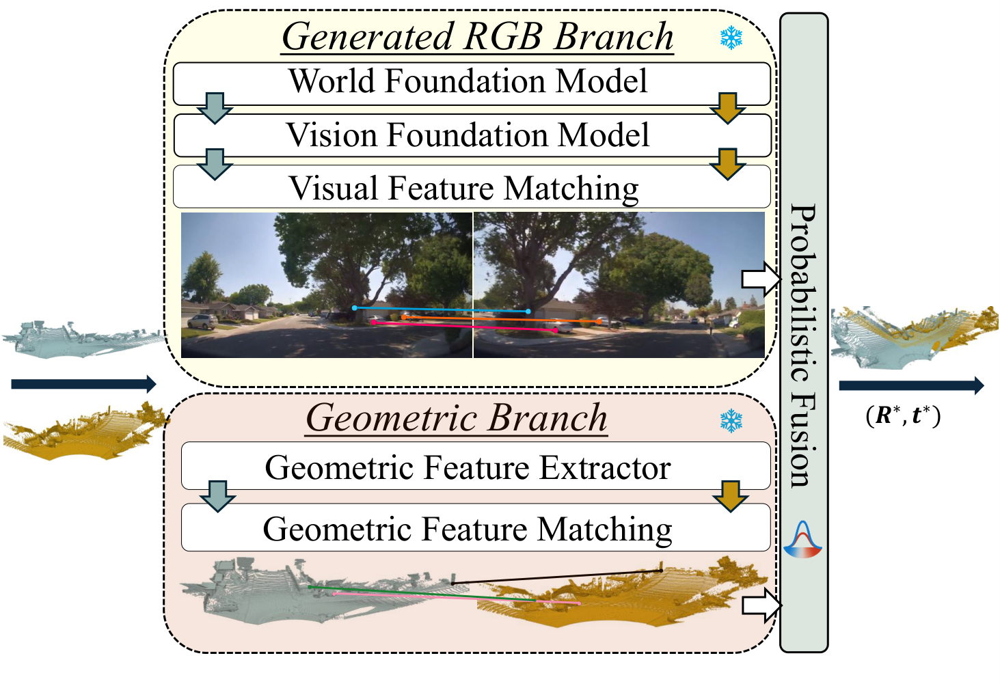
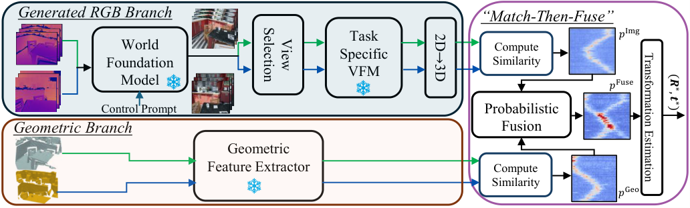

<div align="center">

# C-GenReg: Training-Free 3D Point Cloud Registration by Multi-View-Consistent Geometry-to-Image Generation with Probabilistic Modalities Fusion

<h3>
  <a href="https://scholar.google.com/citations?user=Gsa-kwkAAAAJ&hl=en&oi=ao">Yuval Haitman</a>,
  Amit Efraim,
  <a href="https://scholar.google.com/citations?user=vqojgYAAAAAJ&hl=en&oi=ao">Joseph M. Francos</a>
</h3>

**CVPR 2026**



</div>

C-GenReg enables training-free 3D registration by transforming point clouds into multi-view consistent RGB images, allowing Vision Foundation Model features to augment conventional 3D geometric features for more robust registration.

---

## News

- Paper accepted to CVPR 2026 ([Link to the paper](https://arxiv.org/abs/2604.16680))

---

## Overview

C-GenReg is a zero-shot framework for point cloud registration that combines two complementary signals:



- a generated-RGB branch that turns geometry into multi-view consistent RGB observations and extracts dense visual correspondences with pretrained Vision Foundation Models
- a geometric branch that preserves strong registration-oriented 3D cues directly in point space
- a probabilistic *Match-then-Fuse* module that combines both correspondence posteriors before estimating the final rigid transformation

The method is designed to generalize across sensing domains and supports both indoor RGB-D benchmarks and real outdoor LiDAR data.

---

## Repository Status

This repository is active and will be updated.

- [x] Paper
- [x] Project page assets
- [ ] Environment setup instructions
- [ ] Evaluation scripts

Code release is coming soon.

---

## Highlights

- Training-free, plug-and-play 3D registration
- Multi-view consistent geometry-to-image generation
- Fusion of visual and geometric correspondence posteriors
- Strong zero-shot performance on 3DMatch, ScanNet, and Waymo
- Registration on real outdoor LiDAR data without relying on RGB imagery

---

## Citation

If you find this work useful, please cite:

```bibtex
@article{haitman2026cgenreg,
  title     = {C-GenReg: Training-Free 3D Point Cloud Registration by Multi-View-Consistent Geometry-to-Image Generation with Probabilistic Modalities Fusion},
  author    = {Haitman, Yuval and Efraim, Amit and Francos, Joseph M.},
  journal   = {arXiv preprint arXiv:2604.16680},
  year      = {2026},
  doi       = {10.48550/arXiv.2604.16680},
  url       = {https://arxiv.org/abs/2604.16680}
}
```
