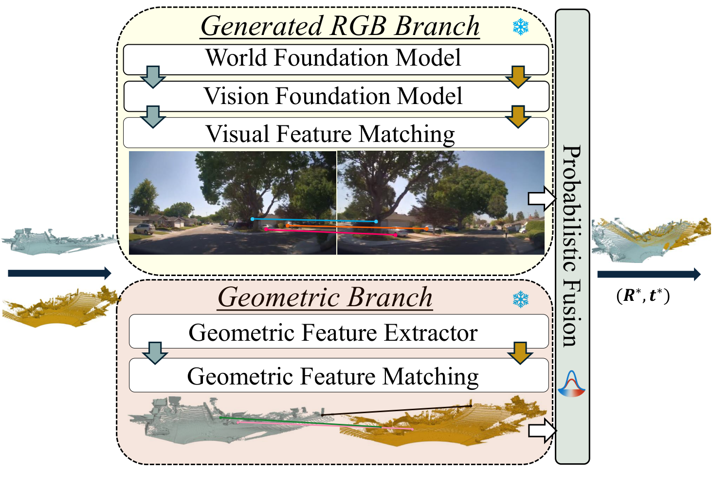
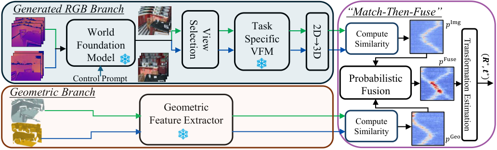

<div align="center">

# C-GenReg: Training-Free 3D Point Cloud Registration by Multi-View-Consistent Geometry-to-Image Generation with Probabilistic Modalities Fusion

<h3>
  <a href="https://scholar.google.com/citations?user=Gsa-kwkAAAAJ&hl=en&oi=ao">Yuval Haitman</a>,
  Amit Efraim,
  <a href="https://scholar.google.com/citations?user=vqojgYAAAAAJ&hl=en&oi=ao">Joseph M. Francos</a>
</h3>

**CVPR 2026**

<p>
  <a href="https://arxiv.org/abs/2604.16680"><strong>Paper</strong></a>
</p>



</div>

C-GenReg is a training-free framework for 3D point cloud registration. It converts geometry into multi-view-consistent RGB observations, extracts dense visual correspondences with pretrained vision foundation models, and fuses them probabilistically with registration-oriented geometric correspondences.

## News

- **2026:** C-GenReg was accepted to CVPR 2026. [[Paper](https://arxiv.org/abs/2604.16680)]
- **Code release:** Inference and preprocessing code for 3DMatch and the ScanNet SuperGlue test split is available in this repository.

## Overview



C-GenReg combines three components:

1. A generated-RGB branch that transforms geometry into multi-view-consistent images and extracts dense MASt3R correspondences.
2. A geometric branch that obtains registration-oriented 3D correspondence features from GeoTransformer.
3. A probabilistic **Match-then-Fuse** module that combines visual and geometric correspondence posteriors before SC2-PCR estimates the rigid transformation.

The method does not require task-specific training and is designed to transfer across sensing domains. The paper evaluates indoor RGB-D and outdoor LiDAR registration; this cleaned release currently focuses on reproducible evaluation for 3DMatch and the ScanNet SuperGlue split.

## Highlights

- Training-free, plug-and-play point cloud registration.
- Multi-view-consistent geometry-to-image generation with Cosmos-Transfer1.
- Probabilistic fusion of visual and geometric correspondence scores.
- Evaluation from cached GeoTransformer features and generated videos, with no training split required.


## Environment Setup

The released code was tested with Python 3.9, PyTorch 2.0.0, CUDA 11.7, and PyTorch Lightning 1.5.0. Create a conda environment:

```bash
conda create -n cgenreg python=3.9 -y
conda activate cgenreg

python -m pip install torch==2.0.0+cu117 torchvision==0.15.1+cu117 \
  --extra-index-url https://download.pytorch.org/whl/cu117
python -m pip install pytorch-lightning==1.5.0 numpy==1.23.5 scipy \
  opencv-python open3d pandas pillow tqdm easydict pyyaml scikit-learn imageio
```

Define portable paths for the repository, external code, datasets, and generated artifacts:

```bash
export CGENREG_ROOT=/path/to/cgenreg
export THIRD_PARTY_ROOT=/path/to/third_party
export DATA_ROOT=/path/to/datasets
export OUTPUT_ROOT=/path/to/outputs

export MAST3R_PROJECT_PATH=$THIRD_PARTY_ROOT/mast3r
```

## External Repositories

### MASt3R and DUSt3R

Clone and install the exact [MASt3R](https://github.com/naver/mast3r) revision used for the experiments:

```bash
git clone --recursive https://github.com/naver/mast3r.git $MAST3R_PROJECT_PATH
cd $MAST3R_PROJECT_PATH
git checkout e87470bcbfa38ce2fb6dcc0735134b70173aefdf
git submodule update --init --recursive
python -m pip install -r requirements.txt
python -m pip install -r dust3r/requirements.txt
```

Pin its nested DUSt3R checkout:

```bash
cd $MAST3R_PROJECT_PATH/dust3r
git checkout 9869e71f9165aa53c53ec0979cea1122a569ade4
```

Compiling the DUSt3R/CroCo RoPE CUDA kernels is optional but recommended for faster inference:

```bash
cd $MAST3R_PROJECT_PATH/dust3r/croco/models/curope
python setup.py build_ext --inplace
```

Place the MASt3R checkpoint at:

```text
$MAST3R_PROJECT_PATH/checkpoints/MASt3R_ViTLarge_BaseDecoder_512_catmlpdpt_metric.pth
```

Download the checkpoint from the [official MASt3R checkpoint server](https://download.europe.naverlabs.com/ComputerVision/MASt3R/MASt3R_ViTLarge_BaseDecoder_512_catmlpdpt_metric.pth).

### GeoTransformer

[GeoTransformer](https://github.com/qinzheng93/geotransformer) is needed to create the cached geometric features. It is not needed again when using already-generated feature files.

```bash
export GEOTRANSFORMER_ROOT=$THIRD_PARTY_ROOT/GeoTransformer
export GEOTRANSFORMER_CKPT=$GEOTRANSFORMER_ROOT/weights/geotransformer-3dmatch.pth.tar

git clone https://github.com/qinzheng93/geotransformer.git $GEOTRANSFORMER_ROOT
cd $GEOTRANSFORMER_ROOT
git checkout e7a135af4c318ff3b8d7f6c963df094d7e4ea540

# The original requirements pin open3d==0.11.2, which is not available from
# current Python 3.9 package indexes. Keep the upstream file unchanged and use
# a compatible local requirements copy.
sed 's/^open3d==0\.11\.2$/open3d==0.19.0/' requirements.txt > requirements-cgenreg.txt
python -m pip install -r requirements-cgenreg.txt
python -m pip install --no-build-isolation -e .
```

Place the GeoTransformer checkpoint at:

```text
$GEOTRANSFORMER_ROOT/weights/geotransformer-3dmatch.pth.tar
```

Download `geotransformer-3dmatch.pth.tar` from the [official GeoTransformer v1.0.0 release](https://github.com/qinzheng93/geotransformer/releases/tag/v1.0.0).

GeoTransformer builds a CUDA/C++ extension. If compilation fails, verify that PyTorch can access CUDA and that the system CUDA toolkit and compiler are compatible with the active environment.

## Datasets

Only test data is required. Obtain the raw [3DMatch test set](https://3dmatch.cs.princeton.edu/) and the required [ScanNet test scenes](https://github.com/ScanNet/ScanNet). The ScanNet image pairs follow the [SuperGlue ScanNet test split](https://github.com/magicleap/SuperGluePretrainedNetwork/blob/master/assets/scannet_test_pairs_with_gt.txt).

The processed 3DMatch test point clouds can be downloaded from [This Link](https://drive.google.com/file/d/1SerEd89FBm29a0cWa4z1MtuK7pWTnp4c/view?usp=drive_link).

Organize the data as follows:

```text
$DATA_ROOT/
  3DMatch/
    test_raw/                  # raw depth frames used by inference
    test/                      # .ply fragments used for GeoTransformer features
  ScanNetSuperGlue/
    ScannetSuperGlue/          # exported ScanNet SuperGlue test scenes
```

The ScanNet export must agree with the selection metadata included in this repository:

```text
datasets/scannet/scannet_test_superglue_metadata_valid.pkl
```

### Prepare the ScanNet SuperGlue test data

After ScanNet approves access, use the following to download the 100 required `.sens` streams, extract only the depth frames and poses, and verify the resulting dataset:

```bash
cd $CGENREG_ROOT
python datasets/scannet/prepare_scannet_superglue.py prepare \
  --download-root $DATA_ROOT/ScanNet_download \
  --output-root $DATA_ROOT/ScanNetSuperGlue \
  --accept-scannet-terms
```

The confirmation flag must be provided only after accepting the [ScanNet Terms of Use](https://kaldir.vc.in.tum.de/scannet/ScanNet_TOS.pdf). Downloads are resumable at scene granularity: rerunning the command skips `.sens` files already present under the download root.

The resulting layout is:

```text
$DATA_ROOT/ScanNetSuperGlue/ScannetSuperGlue/
  scene0707_00/
    depth/*.png
    pose/*.txt
    intrinsic/intrinsic_depth.txt
```

The extraction intentionally omits ScanNet RGB frames because the released evaluation uses Cosmos-generated RGB videos.

If your directory structure differs, pass the corresponding CLI path overrides in the commands below.

## Data Preprocessing

See the [data preprocessing guide](preprocess/DATA_PREPROCESS.md) for instructions on creating the depth videos, generated RGB videos, and GeoTransformer features used by C-GenReg.

Alternatively, the preprocessed data can be downloaded and used directly instead of running the preprocessing code:

- Download Generated RGB videos: [ScanNet SuperGlue](https://drive.google.com/file/d/1mIWA-fLEgT90OMtsuj-GtY5MqY57N_YC/view?usp=drive_link), [3DMatch Test](https://drive.google.com/file/d/1c2hpAkYWA6OmsJTFu5q-oR967Sw4WMRC/view?usp=drive_link)
- Download GeoTransformer features: [ScanNet SuperGlue](https://drive.google.com/file/d/17obimteqBM-xppLm0BvNXuTPKkVTb9F5/view?usp=drive_link), [3DMatch Test](https://drive.google.com/file/d/1LseRxcJ6FMxulnMotVRwAPNKesUc7l0L/view?usp=drive_link)

Extract the downloaded archives and normalize their top-level directories to
the following layout. The directory names below are the names consumed by
inference, even if an archive uses a different wrapper directory:

```text
$DATA_ROOT/
  3DMatch/
    test/
      <scene>/
        cloud_bin_<index>.ply

$OUTPUT_ROOT/
  generated_videos/
    3dmatch_rgb_gen_vids/
      video_<index>/
        output.mp4
        prompt.txt
    scannet_test_superglue_rgb_gen_vids/
      video_<index>/
        output.mp4
        prompt.txt
  3DMatch_GeoTrans_Feat/
    geotransformer_feat_3dmatch/
      *.pkl
  Scannet_Superglue_GeoTrans_feat/
    geotransformer_feat_3dmatch/
      *.pkl
```

The two generated-RGB ZIP files contain these final top-level directory names.
Extract both directly under the generated-video root:

```bash
mkdir -p $OUTPUT_ROOT/generated_videos
unzip /path/to/3dmatch_rgb_gen_vids.zip -d $OUTPUT_ROOT/generated_videos
unzip /path/to/scannet_test_superglue_rgb_gen_vids.zip -d $OUTPUT_ROOT/generated_videos
```

The generated-RGB archives do not include the JSONL files that map dataset
samples to `video_<index>`. Copy the checked-in specs into the output tree:

```bash
mkdir -p $OUTPUT_ROOT/generation_specs

cp $CGENREG_ROOT/cosmos_wfm/specs/3dmatch_test.json \
   $CGENREG_ROOT/cosmos_wfm/specs/scannet_superglue_test.json \
   $OUTPUT_ROOT/generation_specs/
```

Inference uses only the sample-to-video mapping in these specs. If generating
new RGB videos, follow [the Cosmos generation guide](cosmos_wfm/COSMOS_GEN.md)
to rewrite their depth-video paths first.

## Inference

### 3DMatch

```bash
cd $CGENREG_ROOT
export MAST3R_PROJECT_PATH=$THIRD_PARTY_ROOT/mast3r

python inference.py \
  --config configs/config.json \
  --save_name 3dmatch_test \
  --threedmatch_depth_path $DATA_ROOT/3DMatch/test_raw \
  --gen_vid_path $OUTPUT_ROOT/generated_videos/3dmatch_rgb_gen_vids \
  --gen_spec_config $OUTPUT_ROOT/generation_specs \
  --base_geo_3dmatch_feat_path $OUTPUT_ROOT/3DMatch_GeoTrans_Feat/geotransformer_feat_3dmatch
```

### ScanNet SuperGlue

```bash
cd $CGENREG_ROOT
export MAST3R_PROJECT_PATH=$THIRD_PARTY_ROOT/mast3r

python inference.py \
  --config configs/config.json \
  --benchmark scannet_superglue \
  --save_name scannet_superglue_test \
  --scannet_depth_path $DATA_ROOT/ScanNetSuperGlue \
  --gen_vid_path $OUTPUT_ROOT/generated_videos/scannet_test_superglue_rgb_gen_vids \
  --gen_spec_config $OUTPUT_ROOT/generation_specs \
  --base_geo_scannet_superglue_feat_path $OUTPUT_ROOT/Scannet_Superglue_GeoTrans_feat/geotransformer_feat_3dmatch
```


## Evaluation Output

Inference prints registration statistics at the end of each run, including relative rotation error (RRE), relative translation error (RTE), registration recall, inlier ratio, and rotation/translation accuracy at the reported thresholds.

Compact evaluation results are saved to:

```text
results/<save_name>.pkl
```


## Citation

If you find this work useful, please cite:

```bibtex
@InProceedings{Haitman_2026_CVPR,
    author    = {Haitman, Yuval and Efraim, Amit and Francos, Joseph M.},
    title     = {C-GenReg: Training-Free 3D Point Cloud Registration by Multi-View-Consistent Geometry-to-Image Generation with Probabilistic Modalities Fusion},
    booktitle = {Proceedings of the IEEE/CVF Conference on Computer Vision and Pattern Recognition (CVPR)},
    month     = {June},
    year      = {2026},
    pages     = {3004-3013}
}
```

## Acknowledgements

This codebase builds on the following projects:

- [MASt3R](https://github.com/naver/mast3r), used for dense visual correspondence features.
- [DUSt3R](https://github.com/naver/dust3r), used through the MASt3R dependency stack.
- [GeoTransformer](https://github.com/qinzheng93/geotransformer), used to create cached geometric features.
- [SC2-PCR](https://github.com/ZhiChen902/SC2-PCR), integrated as the rigid-registration backend.
- [Cosmos-Transfer1](https://github.com/nvidia-cosmos/cosmos-transfer1), used for geometry-conditioned multi-view image generation.
